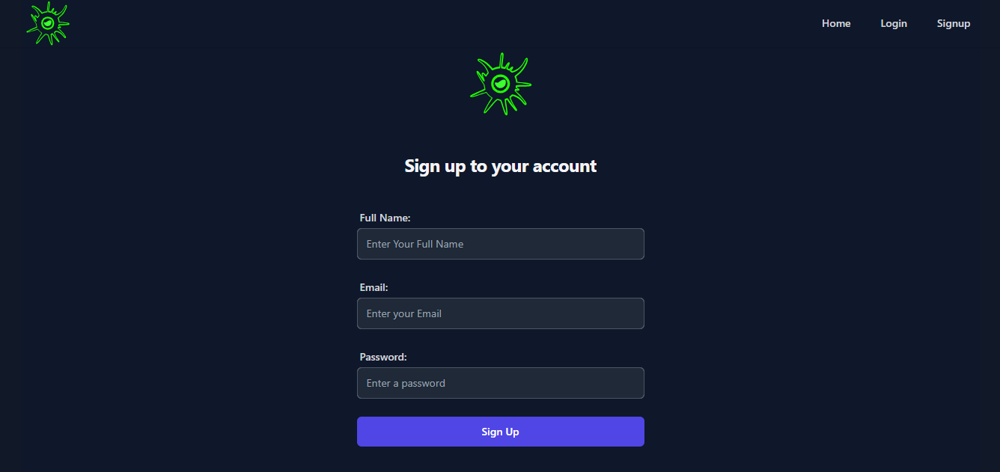
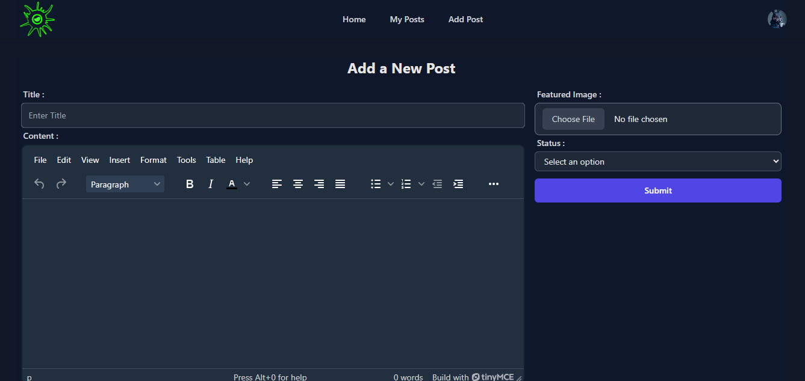
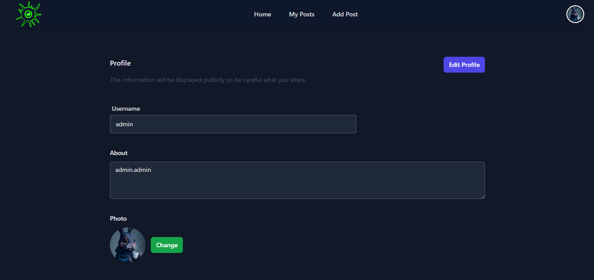

# OrbitInk - A Creative Blogging Platform 🌟

OrbitInk is a dynamic and innovative blogging platform designed for storytellers, thinkers, and idea enthusiasts. With a clean, modern interface and engaging features, OrbitInk offers an effortless experience for both writers and readers to connect, share, and explore new ideas.

## 📸 Screenshots

## 🚀 Features

- **Creative Blogging**: Share compelling stories, personal experiences, and insights with your audience.
- **Modern Design**: Sleek, responsive UI built with React and Tailwind CSS for an engaging user experience.
- **User Authentication**: Secure login and registration for authors to manage their content.
- **Post Management**: Easy-to-use interface for creating, editing, and publishing posts.
- **Mobile-Friendly**: Fully optimized for mobile devices to ensure accessibility on any screen size.
- **Interactive UI**: Real-time previews, smooth transitions, and attractive UI elements to enhance user interaction.

## 🛠️ Tech Stack

- **Frontend**: React.js, Tailwind CSS, React Router
- **Backend**: Appwrite (for data management and authentication)
- **State Management**: React Redux
- **Hosting**: Vercel
- **Authentication**: Appwrite (for managing user login, registration, and session handling)

## 🔑 Usage

- **Authors**: Register an account and log in to create, edit, and publish posts. You can also view a dashboard with your published articles.
- **Readers**: Browse through the latest posts and articles shared by authors.

## 🤝 Contributing

We welcome contributions to make OrbitInk even better! Here’s how you can contribute:

1. Fork the repository.
2. Create a new branch (`git checkout -b feature-name`).
3. Make your changes.
4. Commit your changes (`git commit -am 'Add new feature'`).
5. Push to the branch (`git push origin feature-name`).
6. Create a new Pull Request.

## 🙏 Acknowledgments

- **[Chai aur Code](https://www.youtube.com/c/ChaiAurCode)**: For providing valuable guidance and tutorials that helped me throughout my development journey.
- **Appwrite**: For providing a powerful backend platform to manage our data and authentication.
- **React**: For making frontend development fast and efficient.
- **Tailwind CSS**: For simplifying the design process with utility-first CSS.
- **GitHub**: For providing a platform to share and collaborate on code.
- **Vercel**: For offering a smooth and easy deployment process for frontend applications.

---
